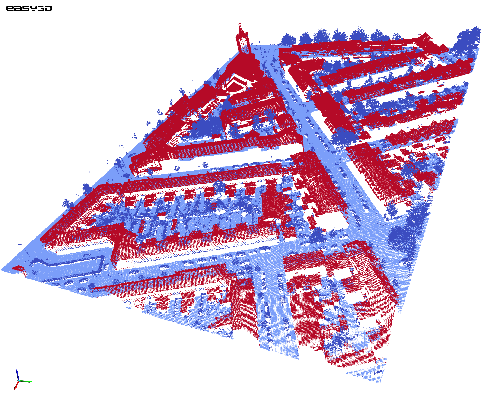

# MultiRoofs Builder

**MultiRoofs Builder** is a user guide that describes how to generate a CityJSON file that is 
compatible with the tools developed as part of the MultiRoofs project.

| | |
|---|---|
| Source | `https://github.com/MultiRoofs/cityjson-extension` <br> `https://github.com/MultiRoofs/UIcityJSON` |
| Last updated | 06-10-2026 |




```{toctree}
:maxdepth: 2

explanation/index
tutorials/index
```
